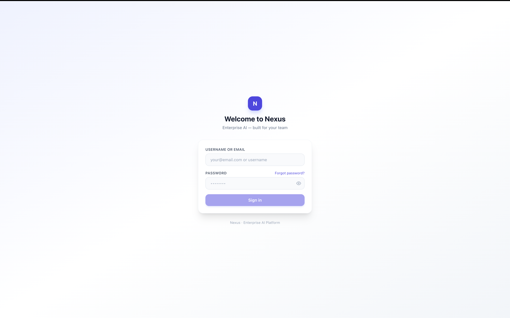
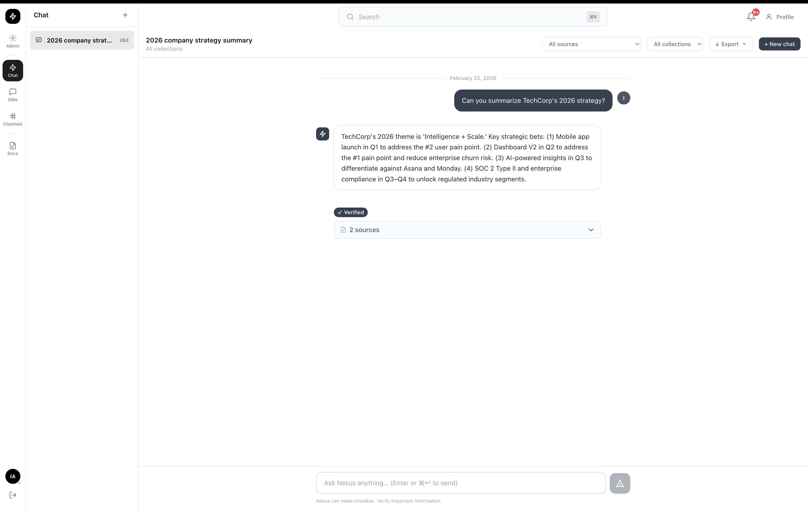
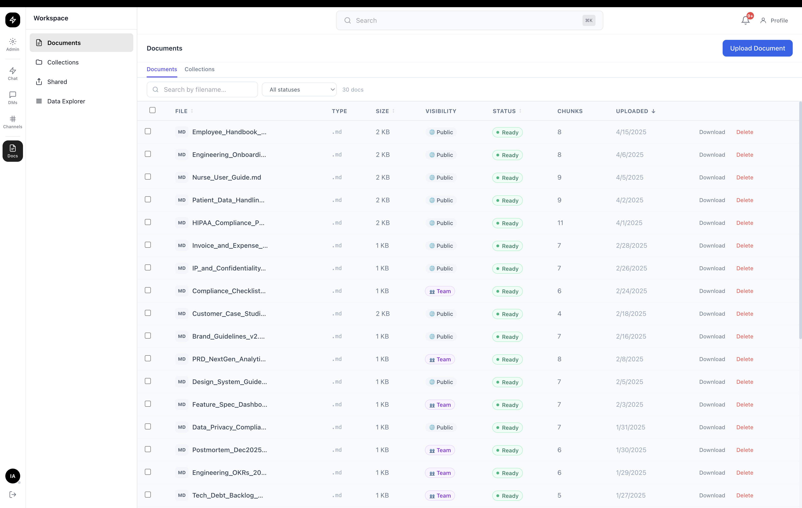
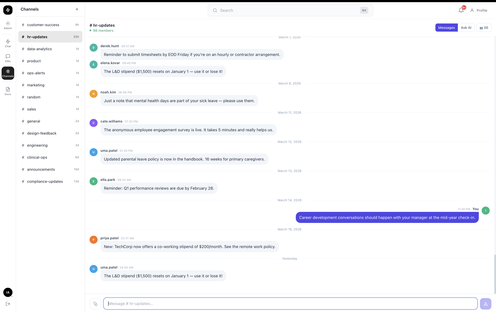
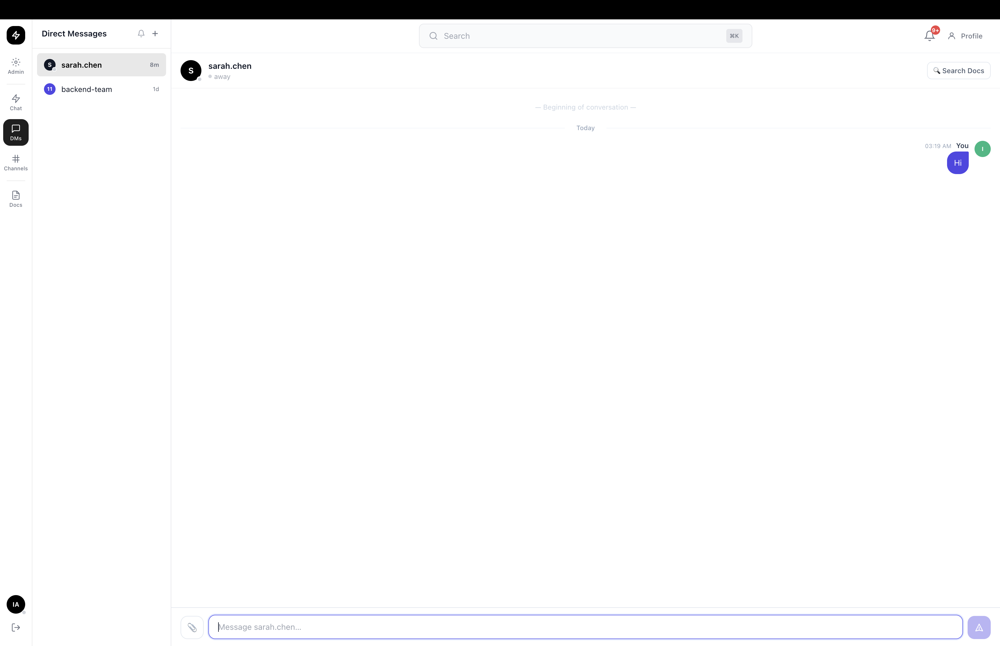
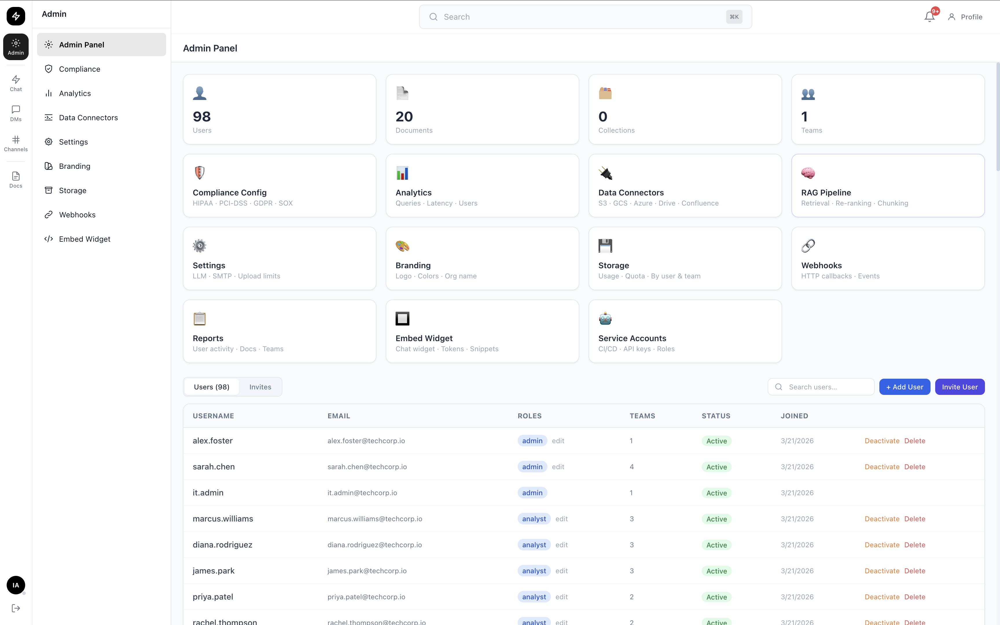
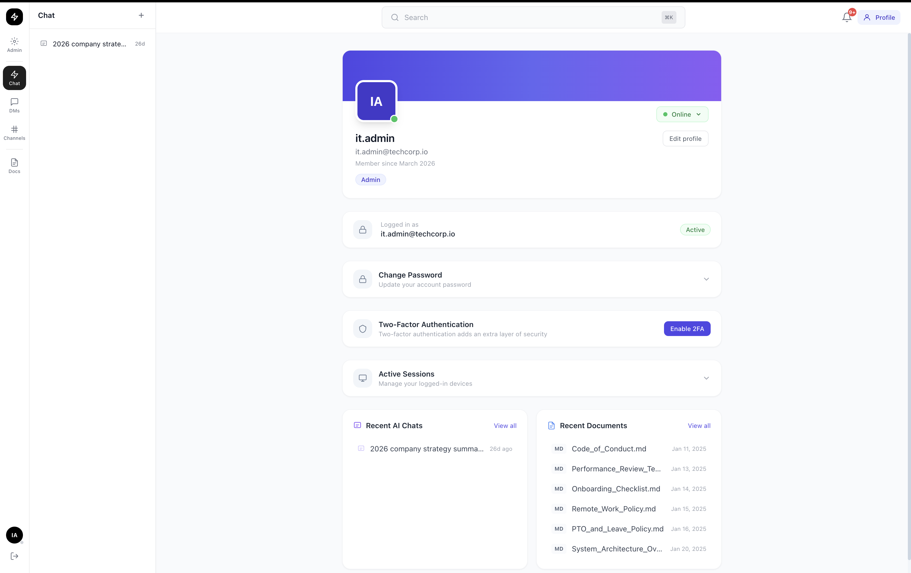

# SecuredDocs

**SecuredDocs** is an open-source, enterprise-grade Retrieval-Augmented Generation (RAG) platform built for teams that need secure, compliant, and intelligent document management with AI-powered search and chat.

---

## Table of Contents

- [Overview](#overview)
- [Screenshots](#screenshots)
- [Features](#features)
- [Architecture](#architecture)
- [Tech Stack](#tech-stack)
- [Getting Started](#getting-started)
  - [Prerequisites](#prerequisites)
  - [Quick Start (Docker)](#quick-start-docker)
  - [Local Development](#local-development)
- [Configuration](#configuration)
- [API Reference](#api-reference)
- [Data Connectors](#data-connectors)
- [Compliance & Governance](#compliance--governance)
- [Authentication & SSO](#authentication--sso)
- [Observability](#observability)
- [Kubernetes Deployment](#kubernetes-deployment)
- [Testing](#testing)
- [Known Limitations & Roadmap](#known-limitations--roadmap)
- [Contributing](#contributing)

---

## Overview

SecuredDocs enables organizations to ingest documents from multiple sources, apply compliance scanning, and provide LLM-powered semantic search and chat — all within a multi-tenant, role-based access control architecture.

Key design goals:

- **LLM-agnostic**: Run fully offline with Ollama or connect to OpenAI, Anthropic, Google Gemini, Azure OpenAI, AWS Bedrock, or vLLM
- **Compliance-first**: Built-in GDPR, HIPAA, PCI-DSS, and SOX scanning at ingestion time
- **Enterprise-ready**: Multi-tenancy, SSO (OAuth2, SAML 2.0, LDAP/AD), RBAC, audit logging
- **Self-hosted**: Every component can run on your own infrastructure — no data leaves your environment

---

## Screenshots

### Login

Clean sign-in screen supporting username or email. Links to forgot-password flow and, when enabled, OAuth (Google / Microsoft) and SAML SSO buttons appear automatically.

### AI Chat

The core RAG interface — ask any question in natural language and get a verified, source-cited answer drawn from your document library. Filter results by source connector or collection, export conversation history, and open multiple chat threads.

### Documents

Workspace document library showing every uploaded file with its type, size, visibility (Public / Team), processing status (Ready / Processing / Failed), chunk count, and upload date. Supports bulk actions, search by filename, and one-click upload.

### Channels

Team channels for real-time discussion (e.g. `#engineering`, `#hr-updates`, `#compliance-updates`). Each channel shows time-since-last-message at a glance. Create new channels and organise teams from the sidebar.

### Direct Messages

1-to-1 and group direct messaging with real-time presence indicators (online / away). A **Search Docs** shortcut inside any DM lets you pull relevant documents directly into the conversation.

### Admin Panel

Full-featured admin dashboard with at-a-glance stats (users, documents, collections, teams) and quick-access cards for: Compliance Config (HIPAA · PCI-DSS · GDPR · SOX), Analytics, Data Connectors, RAG Pipeline, Settings (LLM · SMTP · upload limits), Branding, Storage, Webhooks, Reports, Embed Widget, and Service Accounts. Inline user management table with role editing, status toggling, and invite flow.

### Profile

Per-user profile page with avatar, role badge, member-since date, online-status selector, change-password form, TOTP 2FA enrollment, active session management, and quick-links to recent AI chats and recently accessed documents.

---

## Features

### Document Ingestion & Processing
- **Multi-format support**: PDF (including scanned/OCR), DOCX, PPTX, XLSX, JSON, XML, HTML, TXT, images
- **Advanced OCR**: Tesseract integration for scanned documents
- **Flexible chunking**: Hierarchical, recursive, structural, and tabular chunking strategies
- **Contextual retrieval**: LLM-generated context prepended to each chunk before embedding for higher accuracy
- **Document versioning**: Track updates with full change history
- **Auto-tagging**: LLM-driven automatic tag generation on upload

### Semantic Search & Retrieval
- **Hybrid search**: Dense vector search combined with sparse BM25 for best recall
- **Query rewriting**: HyDE (Hypothetical Document Embeddings), multi-query expansion, single rewrite
- **Cross-encoder re-ranking**: Local flashrank re-ranker (no API key required) for precision improvement
- **Parent-child chunk expansion**: Retrieve parent chunks for full context
- **Semantic caching**: Redis-backed response cache with similarity-threshold deduplication
- **Parallel retrieval**: Query multiple vector stores simultaneously
- **Confidence scoring**: Multi-level confidence thresholds on retrieved results

### AI Chat & Generation
- **Multi-turn conversations**: Persistent conversation threads with Redis-backed sliding-window memory
- **Streaming responses**: Server-sent event streaming with source citations
- **Deep research mode**: Iterative query expansion for comprehensive answers
- **SQL agent**: Natural language querying over structured databases
- **RAG evaluation**: Built-in endpoint for measuring retrieval and generation quality
- **Fine-tuning pipeline**: Framework for model training data collection

### Compliance & Governance
- **Rule engine**: Built-in rules for GDPR, HIPAA, PCI-DSS, SOX
- **PII/PHI detection**: Regex-based scanner with LLM-assisted advanced analysis (optional)
- **Custom compliance rules**: Define organization-specific patterns
- **Compliance reports**: Per-document and fleet-wide compliance reports
- **Audit logging**: Immutable audit trail for all user actions, document access, and queries
- **Data privacy**: Soft-delete (GDPR right-to-be-forgotten), data export (subject access requests), encrypted sensitive fields

### Authentication & Authorization
- **JWT authentication**: Access tokens (30 min) + refresh tokens (7 days)
- **TOTP 2FA**: Time-based one-time passwords with backup codes
- **OAuth 2.0**: Google and Microsoft SSO
- **SAML 2.0**: Enterprise identity provider support
- **LDAP / Active Directory**: Group-to-role mapping with Azure AD sync
- **RBAC**: Admin, analyst, and viewer roles with fine-grained per-resource permissions
- **Multi-tenancy**: Complete company/team isolation with invite-only registration

### Data Connectors
Sync documents automatically from external sources:

| Connector | Status |
|-----------|--------|
| Confluence | Implemented |
| SharePoint | Implemented |
| Google Drive | Implemented |
| AWS S3 | Implemented |
| Azure Blob Storage | Implemented |
| Google Cloud Storage | Implemented |
| SMB / Network File Shares | Implemented |
| Web / Sitemap Crawling | Implemented |

> See [Known Limitations & Roadmap](#known-limitations--roadmap) for connector testing status.

### Administration
- **Admin dashboard**: Users, teams, roles, audit logs, license management
- **Connector management**: Configure, schedule, and monitor syncs from the UI
- **API key management**: Create and revoke API keys for service accounts
- **Webhook support**: `document.ingested` event hooks for downstream integrations
- **Branding customization**: Logo, colors, and UI theme
- **Storage backend**: Switch between local filesystem and MinIO/S3

---

## Architecture

```
┌─────────────────────────────────────────────────────────┐
│                      Frontend (Next.js 14)               │
│   Chat · Documents · Calendar · Admin                   │
└────────────────────────┬────────────────────────────────┘
                         │ REST / WebSocket
┌────────────────────────▼────────────────────────────────┐
│                 Backend (FastAPI + Python 3.11)          │
│  Auth · RAG Pipeline · Compliance · Connectors · API    │
└─────┬──────────┬───────────┬──────────┬─────────────────┘
      │          │           │          │
   ┌──▼──┐  ┌───▼───┐  ┌───▼───┐  ┌──▼──────┐
   │ DB  │  │Vector │  │ Redis │  │  Neo4j  │
   │(PG) │  │ Store │  │(Cache │  │ (Graph) │
   └─────┘  │Qdrant/│  │+Queue)│  └─────────┘
            │Chroma/│  └───────┘
            │PGVec  │      │
            └───────┘  ┌───▼──────┐
                       │  Celery  │
                       │ Workers  │
                       └──────────┘
```

---

## Tech Stack

| Layer | Technology |
|-------|-----------|
| **Backend** | FastAPI 0.135, Python 3.11, SQLAlchemy 2.0 (async) |
| **Frontend** | Next.js 14, React 18, TypeScript, Tailwind CSS |
| **Databases** | PostgreSQL 16 (prod), SQLite (dev) |
| **Vector Stores** | Qdrant, Chroma, PGVector |
| **LLM Providers** | Ollama, OpenAI, Anthropic, Google Gemini, Azure OpenAI, AWS Bedrock, vLLM |
| **Embeddings** | Ollama (nomic-embed-text, 768-dim), cloud API fallbacks |
| **Knowledge Graph** | Neo4j 5 + APOC, LlamaIndex PropertyGraphIndex |
| **Task Queue** | Celery 5.3 + Redis 7 (or RabbitMQ 3) |
| **Object Storage** | MinIO (self-hosted), AWS S3, Azure Blob, GCS |
| **Observability** | Prometheus, Grafana, OpenTelemetry (OTLP/gRPC) |
| **Auth** | python-jose, passlib/bcrypt, PyOTP, xmlsec1 (SAML) |
| **OCR** | Tesseract, pdf2image, pypdf |
| **Search** | rank-bm25, flashrank (ms-marco-MiniLM-L-12-v2) |
| **Containers** | Docker Compose (dev), Kubernetes (prod) |

---

## Getting Started

### Prerequisites

- Docker 24+ and Docker Compose v2
- 8 GB RAM minimum (16 GB recommended for local LLM)
- Git

### Quick Start (Docker)

```bash
# 1. Clone the repository
git clone https://github.com/teja0007/secureddocs.git
cd secureddocs

# 2. Copy and configure environment
cp .env.example .env
# Edit .env to set APP_SECRET_KEY and any API keys

# 3. Start all services
docker compose up -d

# 4. Wait for services to be healthy (~60 seconds first run)
docker compose ps

# 5. Open the app
# Frontend: http://localhost:3000
# API docs: http://localhost:8000/docs
```

The first user to register automatically becomes the admin.

### Local Development

```bash
# Backend
python -m venv .venv
source .venv/bin/activate
pip install -r requirements.txt

# Run database migrations
alembic upgrade head

# Start the API server
uvicorn src.main:app --reload --port 8000

# Frontend (separate terminal)
cd frontend
npm install
npm run dev
```

---

## Configuration

Copy `.env.example` to `.env` and configure the following key variables:

| Variable | Description | Default |
|----------|-------------|---------|
| `APP_SECRET_KEY` | JWT signing key (min 32 chars) | `dev-secret-...` |
| `DATABASE_URL` | PostgreSQL or SQLite connection string | SQLite (dev) |
| `VECTOR_STORE_TYPE` | `chroma`, `qdrant`, or `pgvector` | `chroma` |
| `EMBEDDING_PROVIDER` | `ollama` or cloud provider | `ollama` |
| `LLM_PROVIDER` | `ollama`, `openai`, `anthropic`, etc. | `ollama` |
| `REDIS_URL` | Redis connection string | *(in-process dev mode if blank)* |
| `INVITE_ONLY` | Require invite token to register | `false` |
| `COMPLIANCE_LLM_ENABLED` | Use LLM for compliance analysis | `false` |
| `ENABLE_METRICS` | Expose `/metrics` for Prometheus | `false` |
| `SMTP_HOST` | SMTP server for email | *(blank = log only)* |

For full configuration options see `.env.example`.

---

## API Reference

The interactive API documentation is available at `http://localhost:8000/docs` (Swagger UI) or `http://localhost:8000/redoc`.

All endpoints are prefixed with `/api/v1/`. Key groups:

| Group | Base Path | Description |
|-------|-----------|-------------|
| Auth | `/auth` | Login, register, refresh, password reset, 2FA |
| OAuth | `/auth/oauth` | Google and Microsoft SSO |
| SAML | `/auth/saml` | Enterprise SAML 2.0 SSO |
| Documents | `/documents` | Upload, search, manage documents |
| Chat | `/chat` | Multi-turn RAG chat with history |
| Collections | `/collections` | Document grouping |
| Compliance | `/compliance` | Scan, rules, reports |
| Connectors | `/connectors` | Configure and sync external sources |
| Teams | `/teams` | Team and member management |
| Calendar | `/calendar` | Events, recurring meetings |
| Admin | `/admin` | Users, settings, audit, license |
| Webhooks | `/webhooks` | Outbound event hooks |
| Notifications | `/notifications` | In-app notification management |
| Health | `/health` | Readiness / liveness probe |
| Embed | `/embed` | Public embeddable search widget |

---

## Data Connectors

SecuredDocs can automatically sync content from external sources on a scheduled or manual basis. Configure connectors from the **Admin → Connectors** page.

### Setup

Each connector requires specific credentials stored encrypted in the database:

**Confluence**
```
Base URL, username, API token, space keys to sync
```

**SharePoint**
```
Tenant ID, Client ID, Client Secret, site URL
```

**Google Drive**
```
OAuth 2.0 Service Account JSON credentials, folder IDs
```

**AWS S3**
```
Access Key ID, Secret Access Key, bucket name, prefix (optional)
```

**Azure Blob Storage**
```
Connection string or SAS token, container name
```

**Google Cloud Storage**
```
Service account JSON, bucket name
```

**SMB / Network Shares**
```
Server, share name, username, password, domain
```

**Web Crawler**
```
Start URL, sitemap URL (optional), max pages
```

### Incremental Sync

All connectors support incremental sync — only new or modified documents since the last successful sync are fetched and re-ingested.

---

## Compliance & Governance

### Built-in Rulesets

| Standard | Coverage |
|----------|----------|
| **GDPR** | PII detection, data retention flags, consent markers |
| **HIPAA** | PHI detection, access logging requirements |
| **PCI-DSS** | Payment card data patterns, tokenization markers |
| **SOX** | Financial data patterns, change tracking |

Compliance scanning runs automatically at ingestion. Set `COMPLIANCE_LLM_ENABLED=true` to enable LLM-assisted deep scanning for ambiguous cases.

Custom rules can be created from **Admin → Compliance**.

---

## Authentication & SSO

### Google OAuth 2.0

1. Create credentials at [Google Cloud Console](https://console.cloud.google.com) → APIs & Services → Credentials
2. Add redirect URI: `http://<your-domain>/api/v1/auth/oauth/google/callback`
3. Set `GOOGLE_CLIENT_ID` and `GOOGLE_CLIENT_SECRET` in `.env`
4. Set `NEXT_PUBLIC_GOOGLE_SSO_ENABLED=true`

### Microsoft OAuth 2.0

1. Register app at [Azure Portal](https://portal.azure.com) → App registrations
2. Add redirect URI: `http://<your-domain>/api/v1/auth/oauth/microsoft/callback`
3. Set `MICROSOFT_CLIENT_ID` and `MICROSOFT_CLIENT_SECRET` in `.env`
4. Set `NEXT_PUBLIC_MICROSOFT_SSO_ENABLED=true`

### SAML 2.0

Configure your IdP with the service provider metadata from `/api/v1/auth/saml/metadata`.

### LDAP / Active Directory

Set `LDAP_URL`, `LDAP_BIND_DN`, `LDAP_BIND_PASSWORD`, and `LDAP_BASE_DN` in `.env`.

---

## Observability

### Metrics (Prometheus + Grafana)

```bash
# Enable metrics
ENABLE_METRICS=true

# Prometheus scrapes: http://localhost:8000/metrics
# Grafana dashboard: http://localhost:3001 (admin/admin default)
```

Custom metrics exposed:

| Metric | Type | Description |
|--------|------|-------------|
| `nexus_rag_queries_total` | Counter | Total RAG queries by status |
| `nexus_rag_query_duration_seconds` | Histogram | Query latency distribution |
| `nexus_documents_total` | Gauge | Total documents ingested |
| `nexus_websocket_connections_active` | Gauge | Active WebSocket connections |

### Tracing (OpenTelemetry)

Set `OTEL_ENABLED=true` and `OTEL_EXPORTER_OTLP_ENDPOINT` to send traces to any OTLP-compatible collector (Jaeger, Tempo, etc.).

### Structured Logging

Set `LOG_FORMAT=json` for structured JSON logs compatible with log aggregators (Loki, Datadog, CloudWatch).

---

## Kubernetes Deployment

Production Kubernetes manifests are in the `k8s/` directory.

```bash
# Apply namespace and config
kubectl apply -f k8s/namespace.yaml
kubectl apply -f k8s/configmap.yaml
kubectl apply -f k8s/secret.yaml        # fill in values first

# Deploy services
kubectl apply -f k8s/postgres.yaml
kubectl apply -f k8s/redis.yaml
kubectl apply -f k8s/qdrant.yaml
kubectl apply -f k8s/neo4j.yaml
kubectl apply -f k8s/minio.yaml

# Deploy application
kubectl apply -f k8s/deployment.yaml
kubectl apply -f k8s/service.yaml
kubectl apply -f k8s/ingress.yaml
kubectl apply -f k8s/hpa.yaml           # auto-scaling (2–10 replicas)
```

The backend HPA scales on CPU and memory. Persistent volumes are provisioned for PostgreSQL, MinIO, Qdrant, and Neo4j.

---

## Testing

```bash
# Install dev dependencies
pip install -r requirements.txt

# Run the full test suite
pytest

# With coverage report
pytest --cov=src --cov-report=html

# Run a specific category
pytest tests/test_api/
pytest tests/test_compliance/
pytest tests/test_ingestion/
```

**Current status: 556 passed, 0 failed.**

### Test Categories

| Category | Description |
|----------|-------------|
| `test_api/` | API endpoint tests (auth, documents, chat, compliance, connectors) |
| `test_compliance/` | Rule engine, PII scanner, report generation |
| `test_core/` | RBAC, rate limiting, security, structured logging |
| `test_ingestion/` | Document parsers, chunking strategies, embedding pipeline |
| `test_llm/` | LLM providers, cost tracking, structured output |
| `test_models/` | ORM model validation and relationships |
| `test_repositories/` | Data access layer, audit trail queries |
| `test_services/` | RAG pipeline, retrieval, generation, connectors |
| `test_vectorstore/` | Qdrant, Chroma, PGVector vector operations |

---

## Known Limitations & Roadmap

### Features Requiring Further Testing

The following areas have implementation in place but need more thorough end-to-end testing before being considered stable for production use:

#### Data Connectors
All connectors are implemented but require live credential testing against real external services:

- **Confluence Connector** — Needs testing with live Atlassian Cloud and Confluence Server instances; incremental sync and ACL propagation require validation
- **SharePoint Connector** — Microsoft Graph API permissions and delta sync need end-to-end testing against an actual Microsoft 365 tenant
- **Google Drive Connector** — OAuth service account flow and large folder traversal need validation; shared drive support not yet confirmed
- **AWS S3 Connector** — Bucket policy edge cases (versioned buckets, cross-account access) not yet tested
- **Azure Blob Storage Connector** — SAS token expiry handling and large blob pagination require testing
- **Google Cloud Storage Connector** — Service account IAM permission scope needs validation
- **SMB Connector** — Tested only against basic Samba shares; Windows Server ACL preservation needs further validation
- **Web Crawler** — Authenticated site crawling (login-gated content), JavaScript-rendered pages, and very large sitemaps (10k+ URLs) not yet tested

#### Other Areas
- **SAML 2.0 SSO** — Tested against Okta and Azure AD only; other IdPs (OneLogin, PingFederate, Keycloak) need validation
- **Qdrant vector store** — Basic operations tested; distributed multi-node cluster setup not yet validated
- **AWS Bedrock LLM** — Provider routing implemented; IAM role-based auth in EKS not yet tested end-to-end
- **RabbitMQ broker** — Celery routing with RabbitMQ tested in isolation; failover behavior under load not validated
- **Docling parser** — Advanced document structure preservation (complex tables, multi-column layouts) needs broader document corpus testing
- **Fine-tuning pipeline** — Data collection framework is in place; actual training loop and model registration not yet fully implemented

### Known Issues

- Qdrant tests are marked `xfail` in CI; a running Qdrant instance is required for full vector store test coverage
- SAML 2.0 requires `xmlsec1` to be installed on the host (included in Docker image, manual install needed for local dev on macOS)
- Docling is an optional dependency — document ingestion falls back to pypdf if Docling is not installed

---

## Contributing

Contributions are welcome. Please open an issue to discuss significant changes before submitting a pull request.

1. Fork the repository
2. Create a feature branch (`git checkout -b feature/your-feature`)
3. Write tests for new functionality
4. Ensure all tests pass (`pytest`)
5. Submit a pull request with a clear description of the change

---

## Demo Credentials

Pre-seeded demo accounts for local development are documented in [`demo-credentials.txt`](demo-credentials.txt).

> **These are local development credentials only. Do not use these accounts or passwords in any production environment.**
